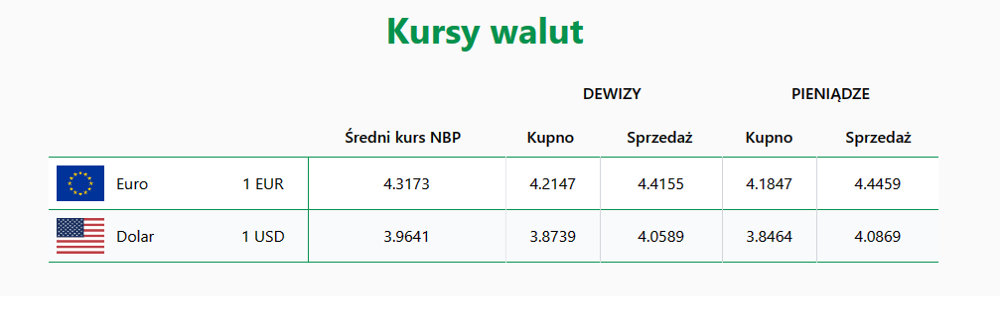

## logo nie posiada minimalnej szerokości
zmienia się jego rozmiar zależnie od rozmiaru okna<br>
można ustawić taki styl który to ustabilizuję
```css
"min-wdth: 250px"
```

## Nagłówek
dopasować do pojedynczej linii na mniejszych ekranach 
(poniżej 1400px szerokości)
<br>
na przykład tak<br>
ponieważ Email nie dodaje żadnej przydatnej informacji

lub


## Nagłówek mobilny

znormalizować wymiary elementów


## Przydatne informacje

można zamienić np. na kursy walut lub inne informacje


## Aktualności

można uwydatnić elementy np. przy pomocy cieni<br>


## Strona produktu

można przenieść listę elementów na prawą stronę by nie zajmowała miejsca (aby była przyklejona do prawej krawędzi)


## Zmiana/rozbudowanie strony produktu


### Rozbudowanie poprzez:
- na stronie grupy produktów dodać kluczowe informacje 

- rozdzielić produkty na pojedyncze strony

- breadcrumb<br>

zamienić element zabierający dużą część ekranu na mały element przekazujący podobne informacje


## Kursy walut
poprawić stylowanie tabeli


np. w taki sposób
